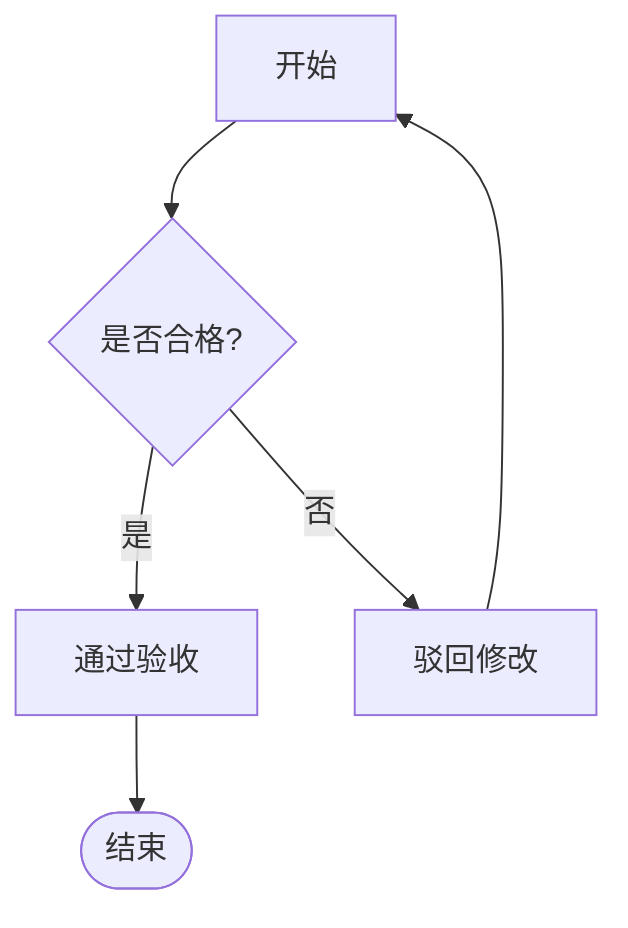
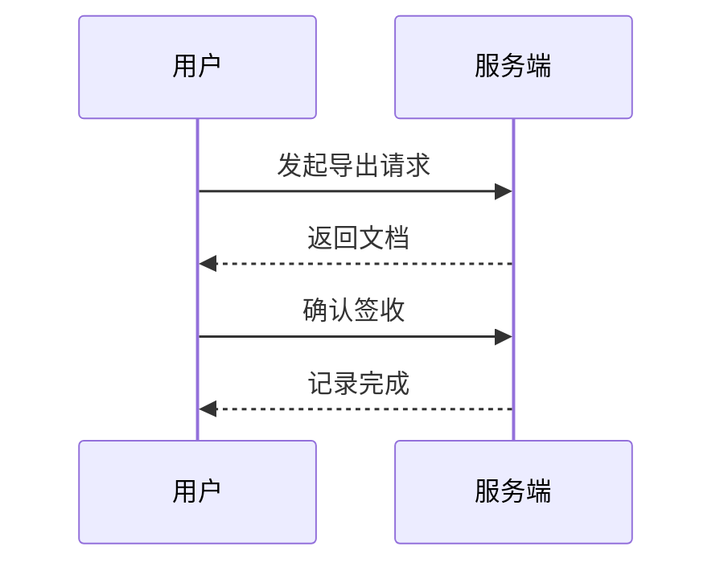
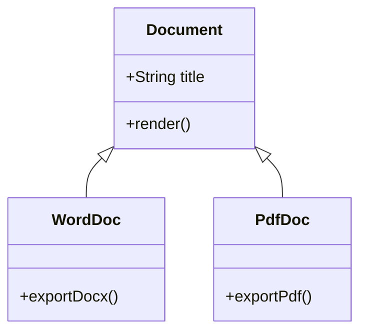
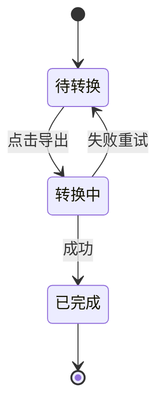
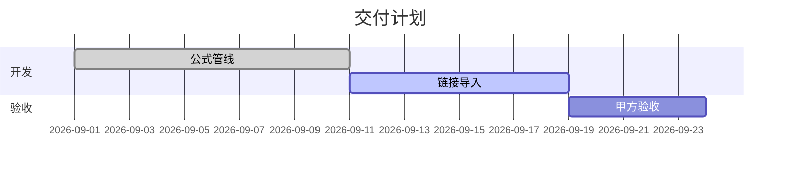
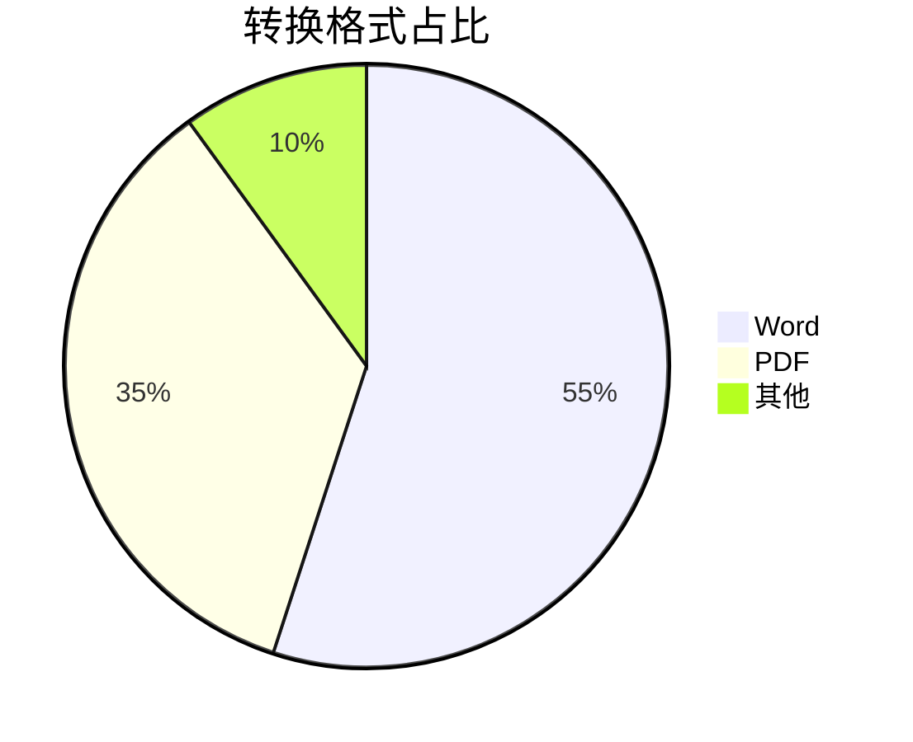

# Mermaid 图表验收样张

本样张包含 6 种 Mermaid 图表类型，导出 Word/PDF 后必须全部为嵌入图片，且不出现任何 Mermaid 源码文本。

## 流程图

```mermaid
graph TD
    A[开始] --> B{是否合格?}
    B -->|是| C[通过验收]
    B -->|否| D[驳回修改]
    D --> A
    C --> E([结束])
```

## 时序图

```mermaid
sequenceDiagram
    participant U as 用户
    participant S as 服务端
    U->>S: 发起导出请求
    S-->>U: 返回文档
    U->>S: 确认签收
    S-->>U: 记录完成
```

## 类图

```mermaid
classDiagram
    class Document {
        +String title
        +render()
    }
    class WordDoc {
        +exportDocx()
    }
    class PdfDoc {
        +exportPdf()
    }
    Document <|-- WordDoc
    Document <|-- PdfDoc
```

## 状态图

```mermaid
stateDiagram-v2
    [*] --> 待转换
    待转换 --> 转换中: 点击导出
    转换中 --> 已完成: 成功
    转换中 --> 待转换: 失败重试
    已完成 --> [*]
```

## 甘特图

```mermaid
gantt
    title 交付计划
    section 开发
    公式管线 :done, a1, 2026-09-01, 10d
    链接导入 :active, a2, after a1, 8d
    section 验收
    甲方验收 :a3, after a2, 5d
```

## 饼图

```mermaid
pie
    title 转换格式占比
    "Word" : 55
    "PDF" : 35
    "其他" : 10
```
