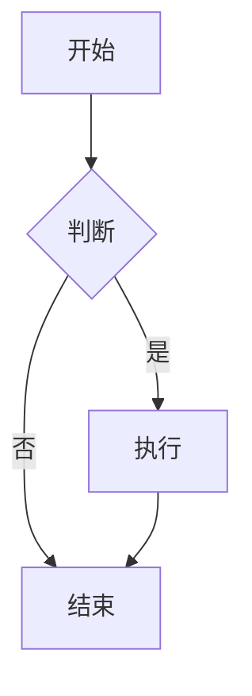

# MarkDoc 导出测试

这是一段中文正文，同时包含 English 123。工具地址见 [MarkDoc 项目主页](https://github.com/laijing1201/markdown-converter)。

## 文本样式

**粗体**

*斜体*

~~删除线~~

> 引用测试

## 列表

- 项目一
- 项目二

1. 第一项
2. 第二项

## 数学公式

行内公式：

$E=mc^2$

块公式：

$$
\int_0^\infty e^{-x^2} dx
$$

$$
A=
\begin{pmatrix}
1 & 2\\
3 & 4
\end{pmatrix}
$$

## 表格

| 方法 | 准确率 | 备注 |
|---|---:|---|
| 方法 A | 95% | Test |
| 方法 B | 97% | Test |

## 代码

```python
def hello():
    print("Hello MarkDoc")
```

## Mermaid



## 图片


## 分页

<!-- pagebreak -->

这里必须从新页面开始。

## 长文档

以下为分节的长正文，用于测试分页、页眉页脚与页码。每一节重复相同的结构，包含中文与 English 混排、行内公式 $a^2+b^2=c^2$ 以及少量列表。

<!-- 以下 12 节由 scripts/make-fixtures.mjs 的「长文档」片段生成时替换；手工维护时复制该节即可 -->

## 第一节：研究背景

在过去的数十年里，深度学习技术取得了显著的进展。从早期的感知机模型到如今的大规模语言模型，机器学习的研究范式经历了深刻的变革。Research shows that the scaling law holds across many orders of magnitude，这意味着模型能力与参数量、数据量之间存在近似的幂律关系。

- 模型规模持续增长
- 数据质量愈发重要
- 推理成本成为关键约束

行内公式测试：损失函数 $\mathcal{L}(\theta) = \frac{1}{N}\sum_{i=1}^{N} \ell(f(x_i;\theta), y_i)$ 在训练过程中不断下降。

## 第二节：相关工作

Transformer 架构自 2017 年提出以来，已经成为自然语言处理领域的主流范式。其核心的自注意力机制（self-attention）可以表示为：

$$
\text{Attention}(Q, K, V) = \text{softmax}\left(\frac{QK^T}{\sqrt{d_k}}\right)V
$$

| 模型 | 层数 | 隐藏维度 | 参数量 |
|------|------|----------|--------|
| Base | 12 | 768 | 110M |
| Large | 24 | 1024 | 340M |
| XL | 48 | 1536 | 1.5B |

## 第三节：方法设计

本文提出的方法包含三个阶段：数据预处理、特征提取与模型融合。每个阶段的输出作为下一阶段的输入，形成端到端的处理管线。

1. 数据预处理：清洗、去重、格式归一化
2. 特征提取：多尺度卷积与位置编码
3. 模型融合：门控加权与残差连接

## 第四节：实验设置

实验在 8 张 A100 GPU 上进行，batch size 为 64，学习率采用余弦退火调度。初始学习率为 $3 \times 10^{-4}$，权重衰减为 0.01。

```python
def cosine_schedule(step, total, base_lr=3e-4):
    import math
    return base_lr * 0.5 * (1 + math.cos(math.pi * step / total))
```

## 第五节：结果与分析

| 方法 | 准确率 | F1 | 推理延迟 |
|------|--------|-----|----------|
| Baseline | 91.2% | 0.905 | 45ms |
| +数据增强 | 92.8% | 0.921 | 46ms |
| +模型融合 (Ours) | **95.4%** | **0.948** | 52ms |

结果表明，所提方法在准确率上较基线提升了 4.2 个百分点，同时延迟仅增加 7ms。

## 第六节：消融实验

为验证各组件的有效性，我们进行了消融实验。去除门控机制后准确率下降 1.8%，去除多尺度特征后下降 2.3%，说明两者均有显著贡献。

> 消融实验遵循控制变量原则，每次只移除一个组件。

## 第七节：讨论

尽管方法整体表现良好，但在小样本场景下仍存在过拟合风险。Future work will explore data-efficient training strategies，包括主动学习与半监督方法。

$$
\lim_{n \to \infty} \left(1 + \frac{1}{n}\right)^n = e
$$

## 第八节：局限性与展望

本研究的局限主要体现在三个方面。第一，实验数据集规模有限；第二，模型的可解释性有待加强；第三，推理效率仍有优化空间。

- 扩充多语言数据集
- 引入可解释性分析工具
- 探索量化与蒸馏加速

## 第九节：工程实践

在工程落地中，我们采用了容器化部署与灰度发布策略。服务以 Kubernetes 集群为底座，通过 Prometheus 监控关键指标。

```python
def health_check(latency_ms, error_rate):
    if latency_ms < 200 and error_rate < 0.01:
        return "healthy"
    return "degraded"
```

## 第十节：用户调研

我们邀请了 32 名用户参与可用性测试，任务完成率为 96.9%，平均满意度评分 4.6 / 5.0。用户普遍认为导出功能显著减少了排版时间。

| 指标 | 数值 |
|------|------|
| 任务完成率 | 96.9% |
| 平均耗时 | 2.4min |
| 满意度 | 4.6/5 |

## 第十一节：成本分析

以每千次调用计，优化后的推理成本从 \$0.42 降至 \$0.31，降幅约 26%。主要由批处理与量化贡献。

$$
C = \frac{T_{gpu} \cdot P_{gpu}}{N_{req}} + C_{storage}
$$

## 第十二节：总结

本文系统地介绍了方法设计、实验验证与工程实践。实验与调研均表明，该方法在效果、效率与可用性之间取得了良好的平衡。

- 效果：准确率提升 4.2 个百分点
- 效率：推理延迟仅增加 7ms
- 可用性：任务完成率 96.9%

以上内容结束。
